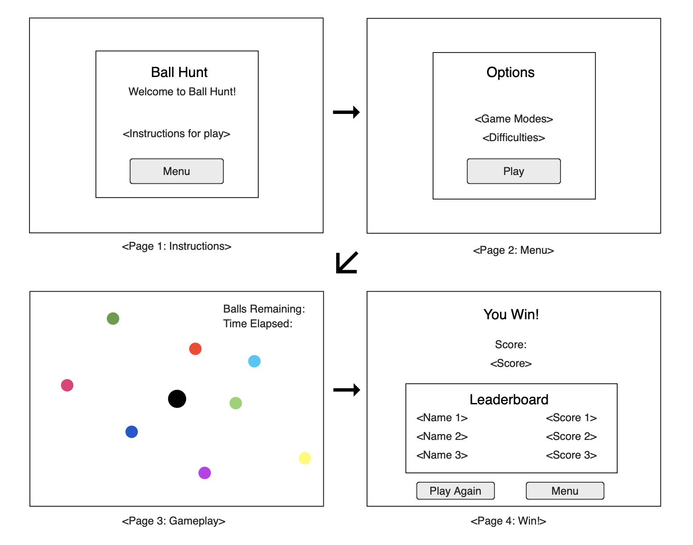

# Web Dev Starter Code

## Project Spec

My general theme is a fully web-based game. I plan to extend the snake.io like game from one of 
the previous labs. The game is going to be very similar to the original lab, but with some added 
options and functionality. For example, I will extend my menu to be a separate page from the 
game. This menu will have added options and game modes. These options will include difficulty 
and control type (i.e. Mouse movement or keyboard movement). The other thing I will be adding is 
different game modes. 

The first game mode I will include will consist of different levels that get increasingly harder 
every time. This game mode will start out with just a couple balls that are going pretty slow. 
The next level will have more balls that are going slightly faster. This will continue with there 
being more balls and faster balls with each level. This game mode will not allow for mouse control 
because that would be too easy.

The second game mode I will include will have the user designate a certain number of balls for the 
game and have a timer that saves the time it takes to get all of the balls. Once the user gets all 
of the balls, the game saves the time to a leader board which gets uploaded to a database on AWS. 
This timed game play along with the leader board will allow for competition and something to make 
the game play more interesting and increase player engagement. The target audience is anyone that 
likes to play games online, especially those that like snake and other games similar to it. 

The main data that will be collected from the user is which game mode they want to play and how 
many balls they want to play with. After the game is played then the play time is also recorded and 
stored on an AWS database. This allows the user to see their past scores and other peoples scores 
to build competition. 

I think that my stretch goals would consist of providing more css to make the game feel like more 
of a full fledged complete game. Along with that, if I complete things sooner than expected, I might 
find more game modes to add to increase the time that users are able to play and stay engaged with 
the game. Something else I might add is customization for the user. For example, letting the user 
choose what color or design they want their player to have. Another feature that would make for a 
good addition would be certain balls that are power ups such as speed boosts to give the user an 
advantage of some kind. This could also add another option to toggle these effects on and off. The 
last thing that would make for a nice addition would be music or sound effects for certain pages and 
events to really tie the game together.

Overall, I am excited for all of the possibilities that doing this game brings.

## Project Wireframe

